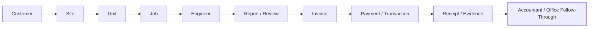

# DurantOS Progress ⚙️✨

  

  
  
  
  

  <a href="#snapshot"><strong>Snapshot</strong></a>
  ·
  <a href="#whats-moving"><strong>What's Moving</strong></a>
  ·
  <a href="#workflow-graph"><strong>Workflow Graph</strong></a>
  ·
  <a href="#milestone-timeline"><strong>Milestone Timeline</strong></a>
  ·
  <a href="#explore-the-docs"><strong>Explore The Docs</strong></a>

  <strong>DurantOS</strong> is the internal command system being built for Durant Lifts. 
  This repository is the public-facing progress layer: product shape, release momentum, and workflow direction without exposing the private implementation.

> Updated April 2, 2026. The current visible push is broader operations control, route coverage mapping, postcode-first address capture, and stronger finance follow-through.

## Snapshot

| Signal | Current read |
| --- | --- |
| 🪟 Public repo shape | docs-only progress tracker |
| 📦 Current documented release | `0.80.0 (768)` |
| 🧭 Product identity | internal command system for lift operations |
| 🗺️ Current visibility | route coverage maps, pinned site views, operational routing clarity |
| 🏢 Data quality direction | postcode-first address lookup and cleaner site records |
| 💸 Finance direction | reconciliation, receipts, invoice evidence, accountant-pack handoff |
| ☁️ Runtime direction | local-first behaviour with wider cloud-backed evidence and coordination |

## What's Moving

DurantOS is no longer just becoming a better admin tool. It is being shaped into one connected operating layer for office, field, finance, and review.

### 🚦 Operations Surface

- a clearer operations area is now part of the visible product shape
- workflow ownership is becoming easier to scan across the business
- the product is moving further toward day-to-day control, not just record storage

### 🗺️ Routing And Coverage

- route coverage is now easier to understand at a broader visual level
- site pins give a faster read of how active routes are spread across the map
- route views are moving from list-only management toward operational geography

### 📮 Address Quality

- postcode-first address lookup is now part of the capture direction
- site and customer records are moving toward faster, cleaner address entry
- better address quality improves routing, mapping, and downstream record confidence

### 💸 Finance Follow-Through

- transaction reconciliation, seeded expenses, cloud receipts, and accountant-pack export remain a major theme
- invoice evidence is staying closer to payment and bookkeeping flow
- the finance layer is becoming more usable as an operational control surface

## Workflow Graph

The product direction is about continuity between operational steps, not isolated screens.

## Why It Matters

- 🧰 Engineers need speed, not friction
- 🧑‍💼 Office staff need clearer control over live work
- 💷 Finance needs evidence attached to the money trail
- 🧾 Reviews and follow-up need to stay grounded in real records
- 🔁 The whole platform needs to survive interruptions, retries, and real operational backlog

## Milestone Timeline

| Date | Milestone | Directional impact |
| --- | --- | --- |
| April 2, 2026 | Operations surface, route coverage maps, and smarter address capture | Public progress now shows a broader operations view, more visual route coverage, and postcode-led address handling as the platform becomes easier to run day to day |
| March 31, 2026 | Finance command and accountant handoff | Transactions, expenses, receipts, invoice-PDF linking, accountant-pack export, and native receipt scanning pushed DurantOS further into a real finance-control surface |
| March 29, 2026 | Notifications, realtime sync expansion, and invoice safety hardening | Engineer push notifications, faster live propagation, safer invoice persistence, and guarded cloud invoice writes moved the platform closer to trusted operational execution |
| March 28, 2026 | Dispatch workflow and broader platform progression | Jobs gained explicit dispatch and engineer response flow, while customer, finance, and extraction work expanded further |
| March 27, 2026 | Sync runtime improvement | Queue flushing and sync throughput improved under backlog conditions |
| March 25, 2026 | Finance and assisted workflow expansion | Finance capture, Outlook intake, payables, VAT automation, and LOLER intelligence moved forward together |

## Public Product Shape

The public view of DurantOS now spans:

- 👥 customers, sites, and units
- 🗓️ office planning, dispatch, and job control
- 📱 engineer mobile delivery
- 🧾 reporting, review, and LOLER follow-up
- 💷 quotes, invoices, payments, and transaction flow
- 🧳 expenses, receipts, and accountant handoff
- 🗂️ document storage and portal publishing
- 🔄 sync, rollback, and recovery-minded platform work

## Explore The Docs

- [Progression](docs/progression.md) - workflow-by-workflow progression summary
- [Releases](docs/releases.md) - release and milestone log
- [Product Shape](docs/product-shape.md) - public summary of what DurantOS is becoming
- [Notice](NOTICE.md) - what is intentionally excluded

## What Stays Private

This repository does not include:

- application source code
- backend source code
- infrastructure secrets or environment values
- deployment configuration
- customer data
- app access instructions
- internal operating procedures

That boundary is deliberate. This repo is here to show momentum, not expose the machine room.
