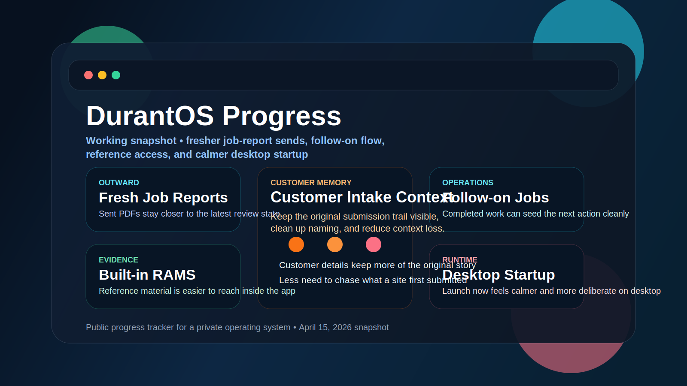

# DurantOS Progress ⚙️✨🚀

  

  
  
  
  

  <a href="#snapshot"><strong>Snapshot</strong></a>
  ·
  <a href="#fresh-in-view"><strong>Fresh In View</strong></a>
  ·
  <a href="#signal-board"><strong>Signal Board</strong></a>
  ·
  <a href="#workflow-graph"><strong>Workflow Graph</strong></a>
  ·
  <a href="#milestone-timeline"><strong>Milestone Timeline</strong></a>
  ·
  <a href="#public-product-shape"><strong>Public Product Shape</strong></a>
  ·
  <a href="#explore-the-docs"><strong>Explore The Docs</strong></a>

  <strong>DurantOS</strong> is the internal command system being built for Durant Lifts. 
  This repository is the public-facing progress layer: product shape, release momentum, workflow direction, and shipping signal without exposing the private implementation.

> Updated April 15, 2026. The current visible push is fresher job-report delivery, follow-on job continuity, built-in reference access, richer customer-intake context, and calmer desktop startup around the same local-first operational core.

## Snapshot

| Signal | Current read | Why it matters |
| --- | --- | --- |
| 🪟 Public repo shape | docs-only progress tracker | this repo is for direction and momentum, not implementation |
| 📦 Current documented release | `0.82.4 (777)` | the platform keeps moving in small, real shipping steps |
| 🧭 Product identity | internal command system for lift operations | the aim is operational control, not generic admin software |
| 💸 Finance direction | hosted invoice payment flow, transaction matching, evidence capture, and accountant-ready follow-through | money trails need clarity and trust |
| 🛠️ Operations direction | maintenance control, route ownership, dispatch clarity, and planner readability | repeat work needs visible coordination |
| 📬 Customer-facing direction | clearer documents, safer delivery paths, and more polished client messages | polished output matters when clients are reading it |
| ☁️ Runtime direction | local-first behaviour backed by wider cloud support | speed and resilience have to coexist |

## Fresh In View

The latest public-facing read of DurantOS now emphasises four things at once:

### 📬 Delivery integrity around completed work

- the public view now shows DurantOS treating the sent job report as a live operational artefact rather than a stale attachment cached earlier in the flow
- review surfaces and sent output are being kept closer together so office users can trust what the customer receives
- this matters because delivery confidence drops quickly when a preview and a sent document appear to disagree

### 🔁 Follow-on continuity instead of workflow dead ends

- completed work can now seed the next job more naturally, keeping site, customer, and unit context closer to the next action
- the public story is becoming less about isolated records and more about one operational step feeding the next
- this matters because repeat or related lift work should not force office users to start again from a blank form

### 📚 Reference access and customer context

- DurantOS is showing more of the supporting operational material inside the product itself, including built-in RAMS access and clearer customer-intake history
- customer records are increasingly behaving like working context, not just a shallow contact card
- this matters because admin users need the original submission trail and reference material close to the live record

### 🖥️ Desktop and operator polish

- the visible direction now includes calmer desktop launch behaviour, cleaner labels, and lightweight cleanup guardrails around large legacy screens
- this keeps the platform feeling maintained rather than only expanded
- the goal is operational confidence, not just more feature count

## Signal Board

DurantOS is not just getting broader. It is getting more connected.

| Track | State | Public read |
| --- | --- | --- |
| 🏗️ Operations core | Live | customers, sites, units, jobs, planners, and route ownership are all clearly part of the platform’s day-to-day identity |
| 🧑‍🔧 Engineer delivery | Live | mobile execution, acknowledgement, and field follow-through remain central to the product story |
| 🛠️ Maintenance command | Hardening | recurring servicing, planner clarity, and unit-aware control are becoming more visible |
| 💼 Commercial and invoicing | Live | quotes, invoices, polished PDFs, and document delivery are a stable public part of the product shape |
| 💸 Accounts workspace | Hardening | transaction review, payment collection, evidence, exports, and performance signal are now a bigger theme |
| 📬 Portal and messaging | Live | customer-facing document access and communication flow remain important to the story |
| 🔄 Sync and recovery | Hardening | resilience, rollback, and safer multi-device behaviour still matter because this is real operational software |

## Workflow Graph

The public product direction is about continuity between operational steps, not isolated admin pages.

## Why It Matters

- 🧰 Engineers need speed, not ceremony
- 🧑‍💼 Office users need live control, not guesswork
- 💷 Finance needs evidence tied to the money trail
- 🧾 Reviews and follow-up need to stay grounded in real records
- 🔁 The whole platform needs to survive retries, interruption, and operational backlog

## Milestone Timeline

| Date | Milestone | Directional impact |
| --- | --- | --- |
| April 15, 2026 | Delivery integrity, follow-on flow, and operator reference access | The public view now shows DurantOS keeping sent job reports closer to the latest review state, letting completed jobs seed follow-on work more cleanly, surfacing built-in RAMS and intake context, and adding calmer desktop startup behaviour |
| April 15, 2026 | Document quality, template polish, and safer fallbacks | The public view now shows DurantOS improving the quality of quote and invoice documents, tightening outward template presentation, and handling supporting-map failures more gracefully |
| April 13, 2026 | Invoice payments, template governance, and resilience hardening | The public view now shows DurantOS moving further into invoice collection, making outward templates easier to review, and treating billing and sync recovery as visible product quality work |
| April 11, 2026 | FreeAgent handoff, evidence capture, and outward polish | The public view now shows DurantOS treating external accounting handoff as live product behaviour, bringing receipt evidence closer to transaction handling, and presenting a more polished customer-facing tone |
| April 5, 2026 | Finance insight, maintenance coordination, and branded shell polish | The public view now shows DurantOS becoming sharper in how it reads invoice performance, clearer in how it frames recurring maintenance control, and more intentional in overall product presentation |
| April 2, 2026 | Operations surface, route coverage maps, and smarter address capture | Public progress began showing a broader operations view, more visual route coverage, and postcode-led address handling as the platform became easier to run day to day |
| March 31, 2026 | Finance command and accountant handoff | Transactions, expenses, receipts, invoice-PDF linking, accountant-pack export, and native receipt scanning pushed DurantOS further into a real finance-control surface |
| March 29, 2026 | Notifications, realtime sync expansion, and invoice safety hardening | Engineer push notifications, faster live propagation, safer invoice persistence, and guarded cloud invoice writes moved the platform closer to trusted operational execution |
| March 28, 2026 | Dispatch workflow and broader platform progression | Jobs gained explicit dispatch and engineer response flow, while customer, finance, and extraction work expanded further |
| March 27, 2026 | Sync runtime improvement | Queue flushing and sync throughput improved under backlog conditions |

## Public Product Shape

The public view of DurantOS now spans:

- 👥 customers, sites, and lift units
- 🗓️ office planning, dispatch, routes, and maintenance control
- 📱 engineer mobile delivery
- 🧾 reporting, review, and follow-through
- 💷 quotes, invoices, payments, and finance signal
- 🧳 receipts, expenses, external accounting handoff, and evidence capture
- 🗂️ document storage and customer-facing delivery
- 🔄 sync, rollback, and recovery-minded platform work

What is becoming more obvious from the public side is not just breadth. It is coherence. DurantOS is being shaped to keep work connected from first record to finance follow-through without losing auditability or operational speed.

## Explore The Docs

- [Progression](docs/progression.md) - workflow-by-workflow progression summary
- [Releases](docs/releases.md) - release and milestone log
- [Product Shape](docs/product-shape.md) - public summary of what DurantOS is becoming
- [Notice](NOTICE.md) - what is intentionally excluded

## What Stays Private

This repository does not include:

- application source code
- backend source code
- infrastructure secrets or environment values
- deployment configuration
- customer data
- app access instructions
- internal operating procedures

That boundary is deliberate. This repo is here to show momentum, direction, and quality of execution without exposing the machine room.
