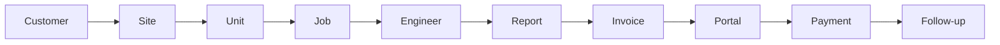

# DurantOS Progress

-111827?style=for-the-badge)

## 🚀 Public Window Into DurantOS

DurantOS is an internal operating platform for Durant Lifts.

It is being shaped to connect office control, engineer delivery, reporting, finance, compliance follow-up, document publishing, notifications, and customer-facing workflows into one coordinated operating system.

This repository is intentionally docs-only. It shows direction, product maturity, and recent momentum without exposing source code, infrastructure, customer data, or private operating logic.

> 🔒 Public progress only. Private implementation remains private.

## ✨ Snapshot

| Signal | Current state |
| --- | --- |
| 🗂️ Public repository | Docs-only progress tracker |
| 📦 Current documented release | `0.80.0 (765)` |
| 📱 Latest iOS milestone | New build uploaded to App Store Connect |
| 🔔 Notification layer | Azure-backed engineer dispatch notifications wired |
| ⚡ Live state direction | jobs, quotes, and invoices now push and refresh much faster |
| 🧾 Billing safety direction | invoice storage and sync conflict handling have both been hardened |

## 🧭 Workflow Spine

DurantOS is being designed around the real chain of lift-service work:

The goal is not just digitising paperwork. The goal is tightening the operating chain between planning, field delivery, review, billing, publishing, and follow-through.

## 🔥 Current Momentum

Recent work has pushed DurantOS further into system-level coordination:

- 🚚 jobs now move through explicit dispatch instead of hiding delivery inside assignment
- 📲 engineers can receive, accept, decline, and return work with office-visible context
- 🔔 Azure-backed mobile notifications are now part of the operational flow
- ⚡ jobs, quotes, and invoices now travel through a faster live sync path
- 🧾 invoice safety has been strengthened both locally and in cloud-write behavior
- 🧠 LOLER and finance-assisted workflows keep improving without removing review control

## 🧱 Platform Areas

The public view of the platform now spans:

- 👥 customer, site, and unit records
- 🗓️ office planning, dispatch, and job control
- 👷 engineer mobile delivery
- 📋 review and LOLER follow-up
- 💬 quotes and quote continuity
- 🧾 invoices, chasing, receipts, and billing workflows
- 💳 payables and expenses
- 📄 document storage and portal publishing
- 🛡️ sync, rollback, and audit-oriented platform work

## 🌊 Progress Themes

### 🚚 Office To Field Workflow

Recent progression has turned jobs into a clearer operational chain:

- assignment separated from dispatch
- explicit engineer acknowledgement
- decline reasons returning work to office review
- undispatch support when work needs to re-enter the dispatch queue
- tighter current-job behavior on engineer mobile

### 🔔 Notifications And Runtime

The platform is moving away from passive sync-only assumptions:

- Azure-backed engineer device registration
- engineer dispatch notifications for mobile delivery
- realtime refresh for key operational containers
- faster propagation for jobs, quotes, and invoices
- stronger handling of queue, backlog, and degraded network states

### 🏢 Commercial And Customer Context

Customer data is no longer a thin address book entry:

- payment terms
- company registration data
- multiple billing recipients
- multiple job-report recipients
- separated communication/accounts contact paths
- website intake and approval flow

### 💷 Finance Control

Finance is progressing from storage into control:

- quote-to-invoice continuity
- sent / overdue / paid logic
- receipt tracking
- chase workflow
- payable and expense capture
- Outlook-assisted finance intake
- invoice safety hardening in both local storage and cloud sync

### 🧠 LOLER And Review

LOLER work continues to progress in a review-safe direction:

- stronger extraction grounding
- better visible evidence
- safer save behavior
- clearer unit-level status visibility

## 🗓️ Milestone Timeline

| Date | Milestone | Directional impact |
| --- | --- | --- |
| March 29, 2026 | Notifications, realtime sync expansion, invoice safety hardening | Engineer push notifications, faster live propagation, safer invoice persistence, and guarded cloud invoice writes moved the platform closer to trusted operational execution |
| March 28, 2026 | Dispatch workflow and broader platform progression | Jobs gained explicit dispatch and engineer response flow, while customer, finance, and extraction work expanded further |
| March 27, 2026 | Sync runtime improvement | Queue flushing and sync throughput improved under backlog conditions |
| March 25, 2026 | Finance and assisted workflow expansion | Finance capture, Outlook intake, payables, VAT automation, and LOLER intelligence moved forward together |

## 🧩 Product Shape

DurantOS is increasingly acting like an internal command system rather than a single admin tool.

The platform now links:

- customers
- sites
- units
- engineers
- jobs
- quotes
- invoices
- payables
- expenses
- contracts
- documents
- portal accounts

That shared graph matters because real business work rarely starts and ends inside one screen or one team.

## 📚 Explore The Docs

- [Progression](docs/progression.md): workflow-by-workflow progression summary
- [Releases](docs/releases.md): release and milestone log
- [Product Shape](docs/product-shape.md): public summary of what DurantOS is becoming
- [Notice](NOTICE.md): what is intentionally excluded

## 🔒 What Stays Private

This repository does not include:

- application source code
- backend source code
- secrets, keys, or environment values
- deployment configuration
- customer data
- app access instructions
- internal operating procedures

That boundary is deliberate. The purpose of this repository is progress visibility, not product exposure.
